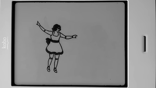

# Welcome

I'm John Neffenger, an independent software developer in Vancouver, British Columbia, Canada.

## Programming

My main open-source [contributions](contributions.html) are listed below and described in the sections that follow.

**2022**
: Created reproducible builds of the OpenJDK and OpenJFX projects.

**2021**
: Published the current releases of OpenJDK and OpenJFX in the Snap Store.

**2020**
: Released the VOLANO chat server under an open-source license.

**2019**
: Ported the JavaFX application framework to devices with e-paper displays.

**2018**
: Learned how to contribute to the OpenJDK project by fixing two font bugs.

### Snap Store

{:.right width="384" height="192"}
In December 2020, I started publishing the current releases of OpenJDK and OpenJFX in the Snap Store when I saw that they were [not available][openjdk-question] in any current release of Ubuntu.
I had been building both projects for years as part of my own testing, but the Snap packages let me document the process and create up-to-date builds for myself and anyone else who wanted them.
The Snap Store now has the current releases and early-access builds of [OpenJDK][openjdk-snap] and [OpenJFX][openjfx-snap] for Linux, built directly from their source code on GitHub.

### VOLANO Chat Server

{:.right width="320" height="192"}
I wrote much of the VOLANO chat server and applets in the spring of 1996.
In the decade that followed, the software became frozen in time at Java version 1.1 mostly due to the dominance of the [Microsoft Java Virtual Machine][msjvm] in Internet Explorer.
In the decade after that, it remained frozen in time mostly due to me.
Now, more than two decades after launching the proprietary software, I hope to breathe some life back into it as an [open-source project][volano].

### JavaFX on E-paper

{:.right width="320" height="180" srcset="images/mechanical-doll-2x.png 2x"}
While attending the SIGGRAPH conference in Vancouver, I was fascinated by an exhibit in the Art Gallery called [*Lineographs*][lineographs], by Joseph Farbrook.
It was the first time I had seen [animation in electronic ink][dancer].
After the conference, I was determined to reproduce the artwork on my own, but I soon learned how difficult that would be.
The documentation was hard to find and provided only a C-language interface to the device driver.
I wanted to use a cross-platform language and framework that would let me test my applications on a desktop computer and run them unmodified on the device.
I preferred a framework like Java and JavaFX, Dart and Flutter, or Python and Qt, but none of them supported embedded devices with e-paper displays.
JavaFX, though, already had much of what I needed to make it work.

So I added the support to JavaFX and contributed the code to the OpenJFX project.
I submitted the code in two parts, with 1,831 new lines of code in all.
The first part, included in JavaFX 13, added a new platform for Linux systems with e-paper displays.
See [Issue #339][jfx-339] for details on the motivation and design of the new platform and [Pull Request #369][jfx-369] for the implementation.
The second part, included in JavaFX 15, added support for additional device models.
See [Issue #521][jfx-521] for details and [Pull Request #60][jfx-60] for the implementation.
I also published a [JavaFX application][epd-javafx] to test the new platform.

### Java Font Fix

{:.right .darkmode width="320" height="60" srcset="images/font-bug-java-2x.png 2x"}
For 10 years, each time I downloaded a new release of Java, I immediately checked whether the font bug had been fixed.
And for 10 years, each time I checked, the bug was still there: color fringes so severe that it was impossible to use.
I came to the conclusion that I needed to fix the problem myself or abandon Java altogether.

I created the repository [OpenJDK FreeType Font Fix][openjdk-freetype] to explain the long and convoluted history of the bug and provide a two-line fix.
The fix is available in Java 12 or later and has been back-ported to the Java 8 and 11 Long Term Support releases.
I am happily still using Java today.

### JavaFX Font Fix

{:.right .darkmode width="320" height="60" srcset="images/font-bug-javafx-2x.png 2x"}
Before trying to fix the Java font bug, I started with the same bug in JavaFX.
Reporting bugs about fonts can be particularly challenging.
It's difficult to convince developers that what you see is a bug rather than a personal preference.
By 2017, there were already two bug reports explaining the problem, but both of them had been closed as "Not an Issue."
By 2018, the bug had persisted for five years.
If I wanted to open yet another bug report, it was going to require some compelling evidence---and probably a fix, too.

I created [Issue #229][jfx-229] to provide both the evidence and the fix, and my [Pull Request #235][jfx-235] was merged into JavaFX the next day.
The fix is available in JavaFX 12 or later.

## Typography

I took on these projects to find out whether I could automate the production of well-formatted books in plain text, HTML, EPUB, Kindle MOBI, and several PDF paper sizes, all from a single source.
The projects were a success thanks to the great open-source tools available in LaTeX, HeVeA, ImageMagick, Potrace, and Inkscape.

### *Wild & Woolly*

{:.left width="135" height="192" srcset="images/wild-and-woolly-2x.png 2x"}
I designed the e-book versions of [*Wild & Woolly: A Journal Keeper's E-book*][play-woolly], by Alfred DePew, and automated the production of PDF files in A4, A5, and A6 paper sizes.
Click the *Read* or *Free sample* button on the Google Play page to view a sample of the work.

### *The Melancholy of Departure*

{:.left width="135" height="192" srcset="images/melancholy-of-departure-2x.png 2x"}
I designed the e-book versions of [*The Melancholy of Departure*][play-melancholy], by Alfred DePew, and automated the production of PDF, EPUB, and Kindle MOBI files.
Click the *Read* or *Free sample* button on the Google Play page to view a sample of the work.

[openjdk-question]: https://answers.launchpad.net/ubuntu/+source/openjdk-15/+question/693547
[openjdk-snap]: https://snapcraft.io/openjdk
[openjfx-snap]: https://snapcraft.io/openjfx

[msjvm]: https://en.wikipedia.org/wiki/Microsoft_Java_Virtual_Machine
[volano]: https://github.com/jgneff/volano

[lineographs]: http://s2014.siggraph.org/attendees/art-gallery/events/lineographs.html
[dancer]: https://www.farbrook.net/lineographs/
[jfx-339]: https://github.com/javafxports/openjdk-jfx/issues/339
[jfx-369]: https://github.com/javafxports/openjdk-jfx/pull/369
[jfx-521]: https://github.com/javafxports/openjdk-jfx/issues/521
[jfx-60]: https://github.com/openjdk/jfx/pull/60
[epd-javafx]: https://github.com/jgneff/epd-javafx

[openjdk-freetype]: https://github.com/jgneff/openjdk-freetype

[jfx-229]: https://github.com/javafxports/openjdk-jfx/issues/229
[jfx-235]: https://github.com/javafxports/openjdk-jfx/pull/235

[play-woolly]: https://play.google.com/store/books/details/Alfred_DePew_Wild_Woolly?id=8c3_AAAAQBAJ
[play-melancholy]: https://play.google.com/store/books/details/Alfred_DePew_The_Melancholy_of_Departure?id=jc3_AAAAQBAJ
